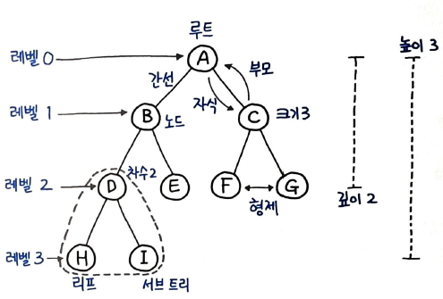
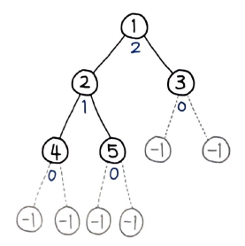
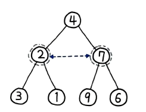
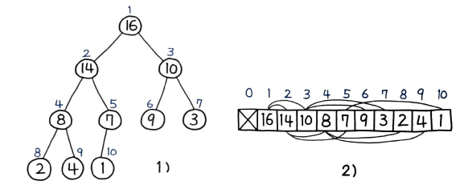
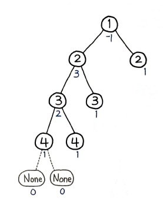

# 트리
> 루트 값과 부모-자식 관계의 서브트리로 구성되며, 서로 연결된 노드의 집합이다.

트리의 중요한 속성 중 하나는 `재귀`로 정의된 `자기 참조` 자료구조라는 점이다. 트리는 자식도 트리고 또 그 자식도 트리다. 

# 트리의 각 명칭 
트리는 항상 `루트`에서부터 시작된다. `루트`는 `자식 노드`를 가지며, `간선(Edge)`으로 연결되어 있다. 자식 노드의 개수는 `차수(Degree)`라고 하며, `크기(Size)`는 자신을 포함한 모든 자식 노드의 개수이다.  
`높이(Height)`는 현재 위치에서부터 `리프`까지의 거리, `깊이`는 루트에서부터 현재 노드까지의 거리이다.


# 그래프 vs 트리
가장 큰 차이점은 바로 `트리는 순환 구조를 갖지 않는 그래프입니다` 이다. 핵심은 순환 구조가 아니라는 데 있다. 트리는 그래프와 달리 어떠한 경우에도 한번 연결된 노드가 다시 연결되는 법이 없다.  
그뿐만 아니라 트리는 하나의 부모 노드를 갖는다는 차이점이 있으며 루트 또한 하나여야 한다.  
# 이진 트리
트리 중에서도 가장 널리 사용되는 트리 자료구조는 `이진 트리`와 `이진 탐색 트리(Binary Search Tree)`이다.   
모든 노드의 차수가 2이하일 때 이진트리이다. 크게 3가지 유형으로 나뉜다.

## 정 이진 트리
모든 노드가 0개 또는 2개의 자식 노드를 갖는다.

## 완전 이진 트리
마지막 레벨을 제외하고 모든 레벨이 완전히 채워져 있으며 마지막 레벨의 모든 노드는 가장 왼쪽부터 채워져 있다.

## 포화 이진 트리
모든 노드가 2개의 자식 노드를 갖고 있으며, 모든 리프 노드가 동일한 깊이 또는 레벨을 갖는다. 문자 그대로, `가장 완벽한` 유형의 트리이다.

# 이진 트리의 최대 깊이
이진 트리의 최대 깊이를 구하라.
## 풀이 1. 반복 구조로 BFS 풀이
트리의 깊이 측정 여러 방법이 있지만, 그 중 하나는 BFS이다. BFS는 재귀가 아닌 `반복` 구조로 풀이할 수 있다.   
```py
def maxDepth(root) :
	...
	queue = collections.deque([root])
	depth = 0

	while queue: 
		...

	return depth
```
큐를 선언하고 반복 구조도 구성하여 BFS 반복을 이용해 풀이할 구조를 잡았다. 파이썬에서 큐는 일반적인 리스트로도 모든 연산이 가능하지만, `데크 자료형`을 사용하면 이중 연결 리스트로 구성되어 있기 때문에 큐와 스택 연산을 모두 자유롭게 할 뿐만 아니라 양방향 모두 O(1)에 추출할 수 있어 좋은 성능을 보인다. `여러번 책에서 강조`되었다  
```PY
while queue :
	depth += 1
	for _ in range(len(queue)) :
		cur_root = queue.popleft()
		...
		if cur_root.has_child() :
			queue.append(cur_root.left)
```
큐 변수에는 현재 깊이 depth에 해당하는 모든 노드가 들어 있고, queue.popleft()로 하나씩 끄집어 내면서 cur_root.has_child()로 자식 노드가 있는지 여부를 판별한 후 자식 노드를 다시 큐에 삽입한다.  
깊이 depth가 반복 횟수이므로 각 깊이에 맞게 노드 삽입이 진행된다.

```py
def maxDepth(root) :
	if root is None :
		return 0

	queue = collections.deque([root])
	depth = 0

	while queue: 
		depth += 1
		# 큐 연산 추출 노드의 자식 노드 삽입
		for _ in range(len(queue)) :
			cur_root = queue.popleft()
			if cur_root.left :
				queue.append(cur_root.left)
			if cur_root.right :
				queue.append(cur_root.right)

	return depth
```
# 43. 이진 트리의 직경
이진 트리에서 두 노드 간 가장 긴 경로의 길이를 출력하라.

## 풀이 1. 상태값 누적 트리 DFS
가장 긴 경로를 찾는 방법은 먼저 가장 말단, 즉 리프 노드까지 탐색한 다음 부모로 거슬러 올라가면서 각각의 거리를 계산해 상태값을 업데이트하면서 다음과 같이 누적해 나가면 된다.


위의 그림처럼, 존재하지 않는 노드에도 -1 이라는 값을 부여한다. 정 이진 트리가 아닌 대부분의 경우에는 존재하지 않는 자식 노드에 -1을 부여해 페널티를 주는 경우가 대부분이다.  
이진 트리의 직경을 구하는 방법은 먼저 가장 말단, 즉 리프 노드까지 탐색한 다음 부모로 거슬러 올라가면서 각각의 거리를 계산해 상태값을 업데이트하면서 다음과 같이 누적해 나가면 된다.
```py
def dfs(node) :
	...
	left = dfs(node.left)
	right = dfs(node.right)
```
이처럼 계속 재귀 호출을 통해 왼쪽, 오른쪽의 각 리프 노드까지 DFS로 탐색한다.

```py
def dfs(node) :
	...
	self.longest = max(self.longest, left + right + 2)
	return max(left, right) + 1
```
이후에는 2개의 값을 계산하는데, 하나는 최종 결과가 될 가장 긴 경로 self.longest, 나머지 하나는 앞서 얘기한 상태값 max(left, right) + 1을 말한다.
```py
a = left + right + 2 # 거리
b = max(left, right) + 1 # 상태값
```
자식 노드가 둘 다 상태값이 0이면 거리 a는 2, 상태값인 b는 1이 된다.  
거리는 왼쪽, 오른쪽 자식 사이의 경로이므로 2를 더하게 되고, 상태값은 양쪽 자식 중 최대 상태값과 부모까지의 거리인 1을 더하게 된다.

```py
class Solution :
	longest: int = 0
	def diameterOfBinary(self, root: TreeNode) -> int: 
		def dfs(node: TreeNode) -> int :
			if not node :
				return -1

			# 왼쪽, 오른쪽의 각 리프 노드까지 탐색
			left = dfs(node.left)
			right = dfs(node.right)

			# 가장 긴 경로
			self.longest = max(self.longest, left + right + 2)

			# 상태값
			return max(left, right) + 1

		dfs(root)
		return self.longest
```
## 중첩 함수에서 클래스 변수를 사용한 이유
중첩 함수는 부모 함수의 변수를 자유롭게 읽을 수 있다. 그러나 중첩 함수에서 부모 함수의 변수를 재할당하게 되면 참조 ID 가 변경되며 별도의 로컬 변수로 선언된다.  
longest 변수의 값은 계속해서 갱신되어야하기 때문에, 즉 `재할당`되어야 하기 때문에 부모 함수의 변수를 그대로 사용불가능하다. 그래서 함수 바깥에서 클래수 변수로 선언을 한 것이다.  
만약 longest의 값이 숫자나 문자가 아니라 리스트나 딕셔너리 같은 자료형이라면 append() 등의 메소드를 이용해 재할당 없이 조작이 가능하다. 중첩 함수 내에서도 변수의 값이 조작가능하다. 그러나, `숫자나 문자`인 경우 불변 객체이기 때문에 중첩 함수 내에서는 값을 변경할 수 없다. 이 때문에 클래스 변수를 사용한 것이다.

# 44. 가장 긴 동일 값의 경로
동일한 값을 지닌 가장 긴 경로를 찾아라.
## 풀이 1. 상태값 거리 계산 DFS
이 문제는 바로 이전 43번 문제와 유사하다. 트리의 말단, 리프 노드까지 DFS로 탐색해 내려간 다음, 값이 일치할 경우 다음과 같이 거리를 쌓아 올려가며 `백트래킹` 하는 형태로 풀이가 가능하다.  
먼저, 다음과 같이 DFS 재귀 탐색을 한다.
```PY
def dfs(node: TreeNode) : 
	...
	left = dfs(node.left)
	right = dfs(node.right)
```
위의 코드처럼 재귀 호출로 내려가면 left, right는 각각 리프 노드에 이르러서 값을 리턴받게 된다. 더 이상 존재하지 않는 노드까지 내려가게 되면 다음과 같은 형태로 값을 리턴한다. 
```py
if node is None: 
	return 0
```
존재하지 않는 노드까지 내려가게 되면 거리 0을 리턴한다. 이제 이 값이 점점 백트래킹 되면서 증가할 것이다. 이 문제는 `동일 값 여부`를 판별해 거리를 계산해야하므로, 다음과 같이 자식 노드가 동일한 값인지 확인하는 과정이 필요하다.
```py
if node.left and node.left.val == node.val :
	left += 1
else :
	left = 0
if node.right and node.right.val == node.val :
	right += 1
else :
	right = 0
```
왼쪽과 오른쪽 자식 노드를 각각 확인해서 현재 노드, 즉 부모 노드와 동일한 경우 각각 거리를 1 증가한다. 이제 다음과 같이 왼쪽 자식과 오른쪽 자식 노드 간 거리의 합을 결과로 한다.
```py
result = max(result, left + right)
```
합이 가장 큰 값을 최종 결과로 한다. 다음번 백트래킹 시 계산을 위해 앞서 문제와 유사헥 상태값을 세팅해서 부모 노드로 올려야 한다. 다음과 같이 부모 노드를 위해 현재까지의 거리를 리턴해준다.
```py
return max(left, right)
```
현재 노드는 양쪽 자식 노드를 모두 연결할 수 있지만 현재 노드의 부모 노드에서는 지금의 양쪽 자식 노드를 동시에 연결할 수 없다. 단방향이므로 양쪽 자식 노드 중 어느 한쪽 자식만 택할 수 있기 때문에 둘 중 큰 값을 상태값으로 리턴해준다. 최종 코드는 다음과 같다.

```py
class Solution:
	result = 0

	def longestUnivaluePath(self, root) :
		def dfs(node) :
			if node is None :
				return 0
			
			# 존재하지 않는 노드까지 DFS 재귀 탐색
			left = dfs(node.left)
			right = dfs(node.right)

			# 현재 노드가 자식 노드와 동일한 경우 거리 1 증가
			if node.left and node.left.val == node.val :
				left += 1
			else :
				left = 0
			
			if node.right and node.right.val == node.val :
				right += 1
			else :
				right = 0

			# 왼쪽과 오른쪽 자식 노드 간 거리의 합 최댓값이 결과
			self.result = max(self.result, left + right)
			# 자식 노드 상태값 중 큰 값 리턴
			return max(left, right)

		dfs(root)
		return self.result
```
# 45. 이진 트리 반전
중앙을 기준으로 이진 트리를 반전 시키는 문제
## 풀이 1. 파이썬다운 방식
사실 파이써닉한 방식으로 짧고 간결하게 풀 수 있다.
```py
def inverTree(self, root) :
	if root :
		root.left, root.right = \
			self.invertTree(root.right), self.inverTree(root.left)
		return root
	return None
```

위의 사진이 마지막 스왑이 일어나기 직전의 상태이다.  
재귀를 꾸준히 학습함으로써 자연스럽게 직관이 생겨나게 하는 것 이 좋다.

## 풀이 2. 반복 구조로 BFS
42번 이진 트리의 최대 깊이 문제와 유사한 형태의 코드이다.
```PY
def invertTree(self, root) :
	queue = collections.deque([root])

	while queue : 
		node = queue.popleft()
		# 부모 노드부터 하향식 스왑
		if node :
			node.left, node.right = node.right, node.left
			queue.append(node.left)
			queue.append(node.right)
```
먼저 삽입된 노드는 반복 구조로 계속 스왑되면서 자식 노드가 계속해서 큐에 추가되는 구조가 된다.  
앞서 재귀 풀이가 가장 말단, 리프 노드까지 내려가서 백트래킹하면서 스왑하는 상향 방식이라면, 이 풀이는 부모 노드부터 스왑하면서 계속 아래로 내려가는 하향 방식 풀이라 할 수 있다.

## 풀이 3. 반복 구조로 DFS
이 풀이를 DFS로 풀이하기 위해 BFS 풀이에서 딱 한줄만 수정했다.
```py
def invertTree(self, root) :
	stack = collections.deque([root])

	while stack : 
		node = stack.pop()
		# 부모 노드부터 하향식 스왑
		if node :
			node.left, node.right = node.right, node.left
			stack.append(node.left)
			stack.append(node.right)

	return root
```
## 풀이 4. 반복 구조로 DFS 후위 순회
앞서 풀이는 전위 순회 형태로 처리했지만, 다음과 같이 `후위(Post-Order)` 순회로 변경해도 아무런 문제가 없다. 그저 `탐색 순서`만 달라질 뿐이다. 
```py
def invertTree(self, root) :
	stack = collections.deque([root])

	while stack : 
		node = stack.pop()
		# 부모 노드부터 하향식 스왑
		if node :
			stack.append(node.left)
			stack.append(node.right)

			node.left, node.right = node.right, node.left # 후위 순회

	return root
```
스왑 위치만 다르고 모든 코드는 동일하다. 풀이 1부터 4의 실행속도는 동일하다. 

# 46. 두 이진 트리 병합
두 이진 트리를 합치는 문제. 중복되는 노드는 값을 합산한다.

## 풀이 1. 재귀 탐색
전체코드는 다음과 같다.
```py
def mergeTrees(self, t1, t2) : 
	if t1 and t2 :
		node = TreeNode(t1.val + t2.val)
		node.left = self.mergeTrees(t1.left, t2.left)
		node.right = self.mergeTress(t1.right, t2.right)

		return node
	else :
		return t1 or t2
```
각각 이진 트리의 루트부터 시작해 합쳐 나가면서 좌, 우 자식 노드 또한 병합될 수 있도록 각 트리 자식 노드를 재귀 호출한다. 만약 어느 한쪽에 노드가 존재하지 않는다면(not(t1 and t2)) 존재하는 노드만 리턴하고 더 이상 재귀 호출을 진행하지 않는다. 만약 양쪽 노드가 모두 존재하지 않는다면 None이 리턴될 것 이다.  
동적 타이핑 언어인 파이썬의 강력한 기능 중 하나는 `return None` 을 생략할 수 있는 점이다.  
위 코드의 구조를 표현하면 다음과 같다.

탐색 순서는 파란글씨로 작성되어있다. 여기서 순서는 리턴으로 백트래킹되는 순서를 기준으로 했다. 리턴 순서만 놓고 본다면 탐색 순서는 `후위 순회` 임을 확인할 수 있다. 

# 47. 이진 트리 직렬화 & 역직렬화

이진 트리를 배열로 직렬화하고 반대로 역직렬화하는 기능을 구현하라. 즉, 다음과 같은 트리는 [1, 2, 3, null, null, 4, 5] 형태로 직렬화할 수 있다.  

## 풀이 1. 직렬화 & 역직렬화 구현
직렬화를 구현하기 위해서는 `이진 트리의 특징과 표현` 에 대해 정확히 알아야 한다. 이진 트리 데이터 구조는 논리적인 구조다. 이를 파일이나 디스크에 저장하기 위해서는 물리적인 형태로 바꿔줘야 하는데 이를 `직렬화` 라고 한다. 

대개 트리의 배열 표현의 경우 계산을 편하게 하기 위해 인덱스는 1부터 사용한다. 깊이는 1, 2, 4, 8, ... 순으로 2배씩 증가하며, 인덱스는 1부터 시작했기 때문에 부모/자식 노드의 위치는 각각 부모 [i / 2], 왼쪽 자식 2i, 오른쪽 자식 2i + 1 의 간단한 수식으로 계산할 수 있다. 이처럼 해당되는 배열의 인덱스는 금방 찾아낼 수 있다.

## 직렬화
직렬화의 전체적인 과정을 정리해보았다.  
이진트리를 BFS 로 표현하면 순서대로 배치되기 때문에 DFS에 비해 매우 직관적으로 알아보기 가능하다.  
BFS 탐색을 위해 45번 `이진 트리 반전` 문제에서 풀이했던 BFS 반복 풀이를 변경해볼 예정이다.

```py
def invertTree(self, root) : # 1
	queue = collections.deque([root])
	
	while queue: 
		node = queue.popleft()
		if node:
			node.left, node.right = node.right, node.left # 2
			queue.append(node.left)
			queue.append(node.right)
		# 결과 변수를 처리하는 부분 : 3
	return root
```
가장 먼저 함수명과 리턴타입을 변경해야한다. 리턴 값을 문자열로 받는다.
```py
def serialize(self, root) -> str :
```
다음으로 스왑하는 부분 수정이다. 
```py
def serailize(self, root) :
	queue = collections.deque([root])
	result = ['#']

	while queue:
		node = queue.popleft()
		if node:
			queue.append(node.left)
			queue.append(node.right)
		...
	return result
```
배열의 빈공간은 '#' 로 표현하기로 하였다. 이 문제의 리턴값을 `문자열`로 받아야 하는데, 파이썬의 널인 None은 문자열로 만들 수 없기 떄문이다.  
위 코드에서 ... 부분, 맨 앞에 가져온 코드에서는 '3' 부분에 result 변수를 처리할 로직까지 추가한다면 다음과 같아진다.
```py
def serialize(self, root) :
	...
	while queue :
		node = queue.popleft()
		if node :
			queue.append(node.left)
			queue.append(node.right)

			result.append(str(node.val))
		else :
			result.append('#')
	return result
```
마지막으로 result는 다음과 같이 리스트가 아닌 배열로 바꿔준다.
```py
return ''.join(result)
```
직렬화한 출력 결과는 다음과 같다.
```py
# A B C # # D E # # # # 
```
## 역직렬화
동일하게 `큐`를 이용해 역직렬화를 진행한다. 노드 변수 root부터 세팅하고, 큐 변수도 만들어준다. 이제 큐를 순회하며서 처리하면 되는데, 왼쪽 자식과 오른쪽 자식은 `각각 별도의 인덱스`를 부여받아 다음과 같이 nodes를 먼저 탐색해나간다.

```py
def deserialize(self, data) :
	nodes = data.split()

	root = TreeNode(int(nodes[1]))
	queue = collections.deque([root])
	
	index = 2
	while queue:
		node = queue.popleft()
		if nodes[index] is not '#':
			node.left = TreeNode(int(nodes[index]))
			queue.append(node.left)
		index += 1

		if nodes[index] is not '# :
			node.right = TreeNode(int(nodes[index]))
			queue.append(node.right)
		index += 1

```
'#' 인 경우에는 큐에 삽입하지 않고, 아무런 처리도 하지않는다.

# 48. 균형 이진 트리
이진 트리가 높이 균형인지 판단하라. 서브 트리 간 높이 차이가 1 이하이여야 한다.

- 입력
```py
[3,9,20,null,null,15,7]
```
- 출력
```py
true
```

- 입력
```py
[1,2,2,3,3,null,null,4,4]
```
- 출력
```py
false
```

## 풀이 1. 재귀 구조로 높이 차이 계산
`높이 균형`은 매우 중요한 개념이다. 균형이 맞아야 효율적으로 트리를 구성할 수 있으며, 탐색 또한 훨신 더 효율적으로 처리할 수 있기 때문이다. 높이 균형을 매번 맞추는 `AVL 트리`가 대표적인 예이다.  
```py
def isBalanced(self, root) :
	def check(root) :
		if not root :
			return 0
		
		left = check(root.left)
		right = check(root.right)
```
재귀 호출로 리프 노드까지 내려간다. 맨 마지막에 이르면 각각 left = 0, right = 0 을 리턴하도록 구성한다. check 함수의 비즈니스 로직은 다음과 같다.
```py
def check(root) :
	...
	if left == -1 or \
			right == -1 or \
			abs(left - right) > 1 :
		return -1
	return max(left, right) + 1
```
left와 right가 모두 0이라면, 차이가 1보다 크지 않으므로 max(left, right) + 1 로 1을 리턴하게 된다. 이런 식으로 점점 1씩 증가하는 형태가 리턴된다.  
문제의 두번째 예시를 그림으로 표현하면 다음과 같다.
  
양쪽 자식 노드 중 어느 하나가 -1이 되는 경우에는 계속해서 -1을 리턴하게 되며, 각 서브트리의 높이 차이가 한 번이라도 1을 초과하는 경우 -1이 할당되며 계속해서 부모 노드로 -1을 리턴하다 최종적으로 False를 리턴하게 된다.

# 49. 최소 높이 트리
노드 개수와 무방향 그래프를 입력받아 트리가 최소 높이가 되는 루트의 목록을 리턴하라.
- 입력
nodes = 6, edges = [[0,3],[1,3],[2,3],[4,3],[5,4]]

- 출력
[3,4]

## 풀이 1. 단계별 리프 노드 제거
최소 높이를 구성하려면 `가장 가운데에 있는 값이 루트`여야 한다. 리프 노드를 하나씩 제거해 나가면서 남아 있는 값을 찾으면 이 값이 가장 가운데 있는 값이 될 것이고, 이 값을 루트로 했을 때 최소 높이를 구성할 수 있다는 뜻이다.  
```py
def findMinHeightTress(selt, n, edges) :
	...
	graph = collections.defaultdict(list)
	for i, j in edges :
		graph[i].append(j)
		graph[j].append(i)
```
이 문제에서 그래프는 무방향이므로, 트리의 부모와 자식은 양쪽 노드 모두 번갈아 가능하다. 따라서, graph 딕셔너리에 양방향으로 삽입하여 구성한다.  
```py
leaves = []
for i in range(n + 1) :
	if len(graph[i]) == 1 :
		leaves.append(i)
```
`리프 노드`를 찾아서 leaves에 추가한다. 리프 노드는 `그래프에서 해당 키의 값이 1개뿐인 것`을 말한다. 실제로 graph의 값을 출력해보면 다음과 같다.
```py
>>> graph
defaultdict(<class 'list'>, {
	1: [3],
	3: [1, 2, 4, 5],
	2: [3],
	4: [3, 6],
	5: [3, 7, 8],
	6: [4, 10],
	10: [6],
	7: [5],
	8: [5, 9],
	9: [8]
})
```
이 중에서 값이 1개 뿐인 [1, 2, 10, 7, 9] 가 첫 번째 리프 노드로 leaves 리스트 변수에 담기게 된다. 다음은 루트가 남을 때까지 반복해서 계속 제거해나가는 로직이다.
```py
while n > 2 :
	n -= len(leaves)
	new_leaves = []
	for leaf in leaves :
		neighbor = graph[leaf].pop()
		graph[neighbor].remove(leaf)

		if len(graph[neighbor]) == 1 :
			new_leaves.append(neighbor)

	leaves = new_leaves
```
n은 전체 노드의 개수이므로 여기서 leves, 즉 리프 노드의 개수만큼 계속 빼나가면서 최종 2개 이하가 남을 떄까지 반복한다. 마지막에 남은 값이 홀수 개일 때는 루트가 최종 1개가 되지만, `짝수 개일 때`는 2개가 될 수 있다. 따라서 while 반복문은 2개까지는 게속 반복한다.  
리프 노드는 `반복하면서 제거` 한다. 그래프 딕셔너리에서 pop()으로 제거하고, 연결된 값도 찾아서 제거한다. 무방향 그래프라 `그래프를 각각 두 번씩 만들었으므로 제거 또한 두 번씩 진행`한다.

## 이진 탐색 트리(BST)
앞서 이진 트리는 `정렬 여부와 관계 없이` 모든 노드가 둘 이하의 자식을 갖는 단순한 트리 형태라고 언급하였다. 그렇다면 `이진 탐색 트리`란 무엇일까??  
> BST 란 `정렬된 트리`를 말한다. 노드의 왼쪽 서브트리에는 그 노드의 값보다 작은 값들을 지닌 노드들로 이뤄져 있는 반면, 노드의 오른쪽 서브트리에는 그 노드의 값보다 같거나 큰 값들을 지닌 노드들로 이루어져 있는 트리

이렇게 `왼쪽과 오른쪽의 값들이 각각 값의 크기에 따라 정렬되어 있는 트리`를 `이진 탐색 트리`라고 한다.  
이 트리의 가장 훌륭한 점은 탐색 시 `시간 복잡도가 O(log n)` 이라는 점이다.  
로그는 1억개의 아이템도 단 27번이면 모두 찾아낼 수 있다.  
이진 탐색 트리는 랜덤하게 생성해도 대부분의 경우 균형이 잘 맞는 아름다운 형태로 트리를 표현할 수 있지만, 운이 나쁘면 트리의 모양이 한쪽으로 치우쳐져서 `O(n)`의 시간 복잡도를 가지게 된다. 리스트형태처럼 되면 루트부터 맨 끝까지 차례대로 모두 탐색해야하므로 비효율적이다.

## 자가 균형 이진 탐색 트리
> 삽입, 삭제 시 자동으로 높이를 작게 유지하는 노드 기반의 이진 탐색 트리다.
이진 탐색 트리의 높이가 `O(log n)`이 되도록 만드는 트리를 `자가 균형 이진 탐색 트리`라고 한다.  
즉, 높이를 가능한 한 낮게 유지하는 것이 중요하다는 얘기다.  
탐색시간이 O(n) 에서 O(log n) 까지 줄어들 수 있으므로, 불균형과 균형의 성능 차이는 꽤 크다. 따라서 트리의 균형, 즉 `높이의 균형`을 맞추는 작업이 매우 중요하다. 이와 같이 높이 균형을 맞춰주는 자가 균형 이진 탐색 트리의 대표적인 형태로는 `AVL 트리`와 `레드-블랙 트리`가 있다. 특히 레드-블랙 트리는 높은 효율성으로 인해 실무에서도 매우 빈번하게 쓰이는 트리 형태이기도 하다.  

# 50. 정렬된 배열의 이진 탐색 트리 반환
오름차순으로 정렬된 배열을 `높이 균형 이진탐색트리`로 변환하라.  
높이 균형이란, 모든 노드의 두 서브 트리 간 깊이 차이가 ` 이하인 것을 말한다.

## 풀이 1. 이진 검색 결과로 트리 구성
BST를 만들기 위해서는 `정렬된 배열`을 이진 검색으로 계속 쪼개 나가기만 하면된다. 당연한 얘기지만 정렬되어 있지 않으면 사용할 숭수 없다. 이전 검색 자체가 정렬된 배열에서는 어떤 값이든지 간에 log(n)에 찾아낼 수 있는 마법이고, 동일한 이름의 BST 또한 당연히 `정렬된 배열`을 기준으로 한다.  
```py
def sortedArrayToBST(self, nums) :
	
	if not nums:
		return None

	mid = len(nums) // 2

	# 분할 정복으로 이진 검색 결과 트리 구성
	node = TreeNode(nums[mid])
	node.left = self.sortedArrayToBST(nums[:mid])
	node.right = self.sortedArrayToBST(nums[mid+1:])
	
	return node
```
정확히 중앙값을 갖도록 내림값을 리턴하는 // 연산자를 사용했다. 즉 lens(nums) 가 3이라면, 2를 나눈 결과인 1.5에서 내림하여 1이 된다.  
파이썬의 `슬라이스` 기능을 이용하면 간단하게 코드 구현이 가능하다. 이것은 절반씩 분할해 처리되는 `분할 정복 구조`로 처리된다. 

# `51. 이진 탐색 트리(BST)를 더 큰 수 합계 트리로`

BST의 각 노드를 현재 값보다 더 큰 값을 가진 모든 노드의 합으로 만들어라.  

- 입력
[4, 1, 6, 0, 2, 5, 7, null, null, null, 3, null, null, null, 8]
- 출력
[30, 36, 21, 36, 35, 26, 15, null, null, null, 33, null, null, null, 8]

## 풀이 1. 중위 순회로 노드 값 누적
자신보다 같거나 큰 값을 구하려면 `자기 자신을 포함한 우측 자식 노드의 합`을 구하면 된다.


예제 입력값을 입력받으면 위의 그림처럼 실행이 된다.  
root를 입력받았을 때 먼저 맨 오른쪽까지 내려가고, 그 다음 부모 노드, 다시 왼쪽 노드 순으로 이동하면서 자신의 값을 포함해 누적한다. `오른쪽 - 부모 - 왼쪽` 순으로 이어지며, 오른쪽 자식부터 운행하는 `중위 순회`에 해당됨을 알 수 있다.
```py
class Solution: 
	val: int = 0

	def bstToGst(self, root) :
		# 중위 순회 노드 값 누적
		if root:
			self.bstToGst(root.right)
			self.val += root.val
			root.val = self.val
			self.bstToGst(root.left)
		
		return root
```
`val` 변수는 누적된 값을 저장하는 변수이다. 

# 52. 이진 탐색 트리(BST) 합의 범위
이진 탐색 트리(BST)가 주어졌을 때, L 이상 R 이하의 값을 지닌 노드의 합을 구하라.
- 입력
root = [10, 5, 15, 3, 7, null, 18], L = 7, R = 15
- 출력
32
- 설명
7 이상, 15 이하인 또 다른 노드는 10이 있으며 따라서 결과는 7+10+15 = 32 가 된다.

## 풀이 1. 재귀 구조 DFS 로 브루트 포스 탐색
이진 탐색 트리의 특성을 이용해 `재귀 구조`로 브루트 포스로 풀 수 있다.  
`재귀 구조`는 `스택`을 이용해 함수를 호출하고, `스택`은 `LIFO` 구조이므로 `DFS`로 풀 수 있다.  
DFS로 전체를 탐색한 다음, 노드의 값이 L과 R 사이일 때만 값을 부여하고, 아닐 경우에는 0을 취해 계속 더해나가면 된다.  
```py
def rangeSumBST(self, root, L, R) :
	if not root :
		return 0
	
	return (root.val if L <= root.val <= R else 0) + \
					self.rangeSumBST(root.left, L, R) + \
					self.rangeSumBST(root.right, L, R)
```
그러나, 이 방법은 모든 노드를 탐색하는 `브루트 포스` 풀이이다. 최적화가 가능하다.

## 풀이 2. DFS 가지치기로 필요한 노드 탐색
DFS로 불필요한 노드는 `가지치기`를 통해 최적화를 진행하는 풀이이다. 
```PY
def dfs(node: TreeNode) :
	...
	if node.val < L :
		return dfs(node.right)
	elif node.val > R :
		return dfs(node.left)
```
이진 탐색 트리는 왼쪽이 항상 작고, 오른쪽이 항상 크다. 즉 현재 노드 root가 L 보다 작을 경우, 더 이상 왼쪽 가지는 볼 필요가 없다. 불필요한 탐색을 줄여 최적화 할 수 있다.
```PY
def rangeSumBST(self, root, L, R) :
	def dfs(node) :
		if not node :
			return 0

		if node.val < L :
			return dfs(node.right)
		elif node.val > R :
			return dfs(node.left)
		return node.val + dfs(node.left) + dfs(node.right)

	return dfs(root)
```
## 풀이 3. 반복 구조 DFS로 필요한 노드 탐색
대부분의 재귀 풀이는 반복으로 변경할 수 있다. 일반적으로 반복 풀이가 재귀 풀이에 비해 좀 더 직관적으로 이해가 쉽다.
```py
def rangeSumBST(self, root, L, R) :
	stack, sum = [root], 0
	# 스택 이용 필요한 노드 DFS 반복
	while stack :
		node = stack.pop()
		if node :
			if L < node.val :
				stack.append(node.left)
			if node.val < R :
				stack.append(node.right)
			if L <= node.val <= R :
				sum += node.val
	return sum
```
유효한 노드만 스택에 계속 집어 넣으면서, L과 R사이의 값인 경우 값을 더해 나간다.
## 풀이 4. 반복 구조 BFS로 필요한 노드 탐색
BFS로 탐색해도 동일하다. 여기서는 스택을 단순히 큐 형태로 바꾸기만 하면, BFS를 구현할 수 있다.  
원래는 파이썬의 데크를 사용해야 성능을 높일 수 있지만, 여기서는 편의상 간단히 리스트를 그냥 pop(0)로 처리하는 정도로 구현한다.
```py
def rangeSumBST(self, root, L, R) :
	queue, sum = [root], 0
	# 큐 이용 필요한 노드 BFS 반복
	while queue :
		node = queue.pop(0)
		if node :
			if L < node.val :
				queue.append(node.left)
			if node.val < R :
				queue.append(node.right)
			if L <= node.val <= R :
				sum += node.val
	return sum
```
# `53. BST 노드 간 최소 거리`
두 노드 간 값의 차이가 가장 작은 노드의 값의 차이를 출력하라.
## 재귀 구조로 중위 순회
이진 탐색 트리의 중위 순회 결과는 오름차순으로 정렬된 결과를 얻을 수 있다.
```py
def f() :
	if root.left :
		f(root.left) 
	
	result = min()

	if root.right :
		f(root.right)
```
위의 형태가 중위 순회의 기본 뼈대가 될 것 이다. 
```py
class Solution :
	prev = -sys.maxsize
	result = sys.maxsize

	# 재귀 구조 중위 순회 비교 결과
	def minDiffInBST(self, root) :
		if root.left :
			self.minDiffInBST(root.left)

		self.result = min(self.result, root.val - self.prev)
		self.prev = root.val

		if root.right :
			self.minDiffInBST(root.right)
		
		return self.result
```
그림으로 위의 코드 흐름을 보면 다음과 같다.


## 풀이 2. 반복 구조로 중위 순회
재귀일 때는 prev와 result를 클래스 멤버 변수로 선언했지만, 반복 구조에서는 한 함수 내에서 처리할 수 있기 때문에 함수 내 변수로 선언이 가능하다는게 차이점이다.
```py
def minDiffInBST(self, root) :
	prev = -sys.maxsize
	result = sys.maxsize

	stack = []
	node = root

	# 반복 구조 중위 순회 비교 결과
	while stack or node :
		while node :
			stack.append(node)
			node = node.left

		node = stack.pop()

		result = min(result, node.val - prev)
		prev = node.val

		node = node.right	
```
DFS 풀이인 만큼 스택을 사용했고, 오른쪽 자식 노드를 택하기 전에 비교하는 형태로 재귀와 동일하게 `중위 순회`로 풀이했다.

# 트리 순회
> 그래프 순회의 한 형태로, 트리 자료구조에서 각 노드를 정확히 한 번 방문하는 과정
그래프 순회와 마찬가지로, 트리 순회 또한 `DFS` 또는 `BFS`로 탐색한다. 특히 이진 트리에서 DFS는 노드의 방문 순서에 따라 다음과 같이 3가지 방식으로 구분된다.
1. 전위(Pre-Order) 순회(NLR)
2. 중위(In-Order) 순회(LNR)
3. 후위(Post-Order) 순회(LRN)
N은 현재노드, L은 현재 노드의 왼쪽 서브트리, R은 현재 노드의 오른쪽 서브트리를 의미한다.  
  
- 왼쪽 점(전위) : F, B, A, D, C, E, G, I, H
- 아래쪽 점(중위) : A, B, C, D, E, F, G, H, I
- 오른쪽 점(후위) : A, C, E, D, B, H, I, G, F  
각 순회 방식을 코드를 통해 구체적으로 살펴보자. 트리의 순회 방식은 `재귀` 또는 `반복`, 모두 구현이 가능하지만, 트리의 재귀적 속성으로 인해 `재귀` 쪽이 훨씬 더 구현이 간단하다.  
연결 리스트를 담을 Node 클래스를 정의하고 트리의 전체 입력값을 root 변수로 다음과 같이 정의해봤다.
```py
class Node :
	def __init__(self, val, left=None, right=None) :
		self.val = val
		self.left = left
		self.right = right
	
	root = Node('F',
					Node('B',
			Node('A'),
			Node('D',
				Node('C'),
				Node('E')
			)
		),
		Node('G',
			None,
			Node('I',
				Node('H')
			)
		)
	)

```
## 전위 순회
```PY
def preorder(node) :
	if node is None: 
		return
	print(node.val, end=' ')
	preorder(node.left)
	preorder(node.right)
```
재귀로 구현하면 반복보다 코드가 매우 간결하고 보기 쉽다. 
## 중위 순회
```PY
def inorder(node) :
	if node is None: 
		return
	inorder(node.left)
	print(node.val, end=' ')
	inorder(node.right)
```
## 후위 순회
```py
def postorder(node) :
	if node is None: 
		return
	postorder(node.left)
	postorder(node.right)
	print(node.val, end=' ')
```

# 54. 전위, 중위 순회 결과로 이진 트리 구축
트리의 전위, 중위 순회 결과를 입력값으로 받아 이진 트리를 구축하라.
## 풀이 1. 전위 순회 결과로 중위 순회 분할 정복
순회에는 크게 전위, 중위, 후위 순회가 있으며 `이 셋 중 2가지만 있어도 이진 트리를 복원 가능`하다.  

위처럼 트리 그림을 1부터 9까지 좀 더 복잡한 형태로 새로 구성해봤다. `전위의 첫 번째 결과값은 부모 노드`다. 즉 `전위 순회의 첫 번째 결과는 정확히 중위 순휘 결과를 왼쪽과 오른쪽으로 분할시키는 역할`을 한다.  
중위 순회의 `분할 정복`문제로 바꿀 수 있는 것 이다.두 번째로 왼쪽 노드의 2는 중위 순회 결과를 정확히 반 가르고, 각각 왼쪽 자식은 4, 오른쪽 자식은 5로 마무리한다.  
오른쪽의 경우 3이 첫번째 값인데, 마침 중위 순회에서는 맨 오른쪽에 위치해 있다. 이 말은 `3의 오른쪽 자식 노드는 존재하지 않는다는 얘기다`. 이런식으로 분할해서 정복을 하면된다.
```py
index = inorder.index(preorder.pop(0))
```
먼저, 전위 순회 첫 번째 결과를 가져와 중위 순회를 분할하는 인덱스로 한다.
```py
node = TreeNode(inorder[index])
node.left = self.buildTree(preorder, inorder[:index])
node.right = self.buildTree(preorder, inorder[index+1:])
```
이 값을 현재 노드로 구성하고, 이를 기준으로 중위 순회 결과를 쪼개서 왼쪽, 오른쪽으로 각각 마무리 될 때 `분할 정복` 구조로 재귀 호출하면, 트리 구성이 가능하다.
```py
def buildTree(self, preorder, inorder) :
	if inoder :
		# 전휘 순회 결과는 중위 순회 분할 인덱스
		index = inorder.index(preorder.pop(0))

		# 중위 순회 결과 분할 정복
		node = TreeNode(inorder[index])
		node.left = self.buildTree(preorder, inorder[:index])
		node.right = self.buildTree(preorder, inorder[index+1:])

		return node
```
전위 순휘 결과는 pop(0)으로 가져온다. 즉 큐 연산이며 파이썬에서는 `데크`로 구현가능하다.