UMC 동아리에서 2주차때 배운 내용을 정리해보았다. 이번 주차땐 주로 네트워크 관련 개념과 실습을 진행하였다.

# 개념 키워드
## 외부접속, 내부접속
외부접속이란, `내부에 있는 서버로 접속하는 행위` 이다.
어디가 외부인지는 상대적인 개념이다. 사용자, 서버, 공유기, 개발자 등이 될 수 있다.

## `포트포워딩`이 필요한 이유
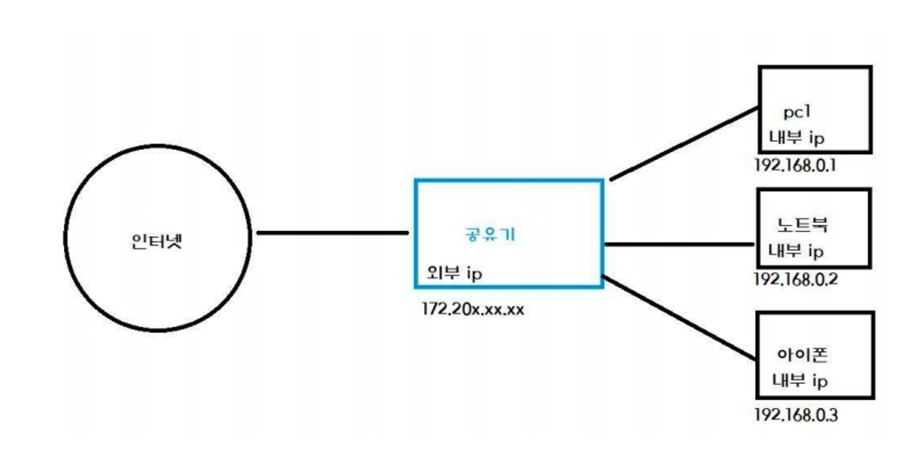

PC1 에서 서버가 돌아간다면,  
1) 공유기를 공유하는 기기에서 접근
2) 공유기에 연결되지 않은 다른 네트워크 기기에서 접근  

2가지 방법이 존재한다.  

> 공유기를 공유하는 기기에서 접근하는 방법

노트북에서는 192.168.0.1:[포트번호] 를 통해 접근한다.  
-> 방화벽에서 `인바운드 규칙` 을 추가해야 한다.

> 공유기에 연결되지 않은 다른 네트워크 기기에서 접근

다른 기기에서는 172.20x.xx.xx:[포트번호] 를 통해 접근해야한다.  
만약 외부에서 172.20x.xx.xx:8080 으로 접근을 요청했다면 공유기에 접근을 요청한 것 이다. 그러나, 공유기는 이 요청을 어디에 전달해야할 지 모른다.  
이 때 필요한 것이 `포트포워딩` 이다.  
공유기에 미리 8080포트로 연락이 오면 `어떤 기기에 어떤 포트로 요청을 전달해` 라고 알려주는 것 이다.  
즉, 접속을 시도하려고 하는 곳에 `이정표`를 달아주는 작업이라 할 수 있다.

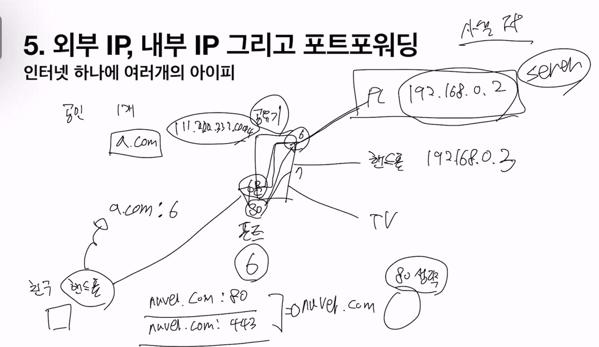

위 사진의 a.com:6 의 6은 외부포트이고, 안에 있는 PC 서버의 포트는 내부포트이다.  
이 두 포트, 즉, 문과 문을 연결해주는 작업을 포트포워딩이라 할 수 있다.

## 클라이언트 - 서버 모델 VS P2P 모델
### 클라이언트 - 서버
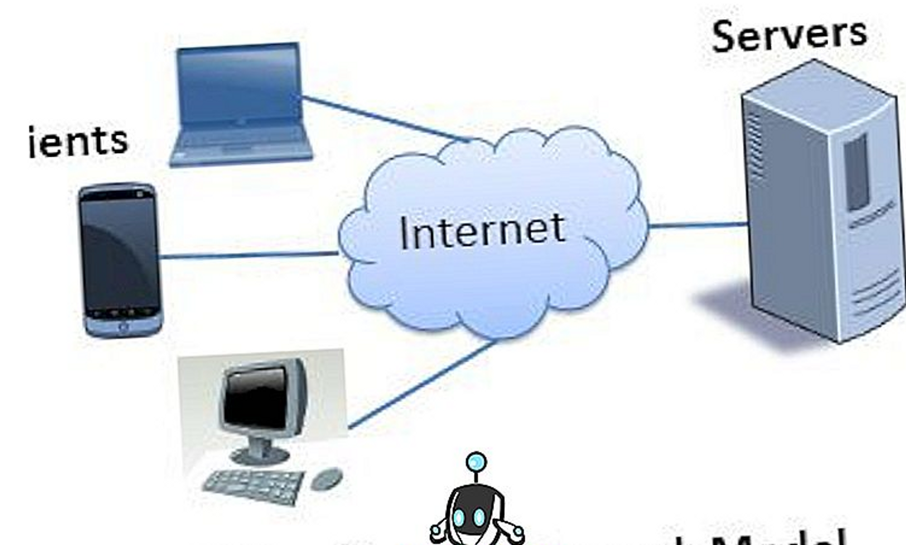
클라이언트가 요청을 보내면, 서버가 요청된 데이터를 확인하고 응답과 함께 다시 보낸다.
모든 서비스가 중앙 집중식 서버에 의해 제공되므로 `병목현상` 이 발생하여 시스템의 효율성이 저하될 수 있다.  
P2P 보다 비싸지만, 확정성 및 안정성을 확보 가능하다.  
여기서 병목현상이란, 한 구성요소로 인해서 더 강력한 성능의 구성요소가 최고의 성능을 발휘하지 못하는 영상이다.

### P2P
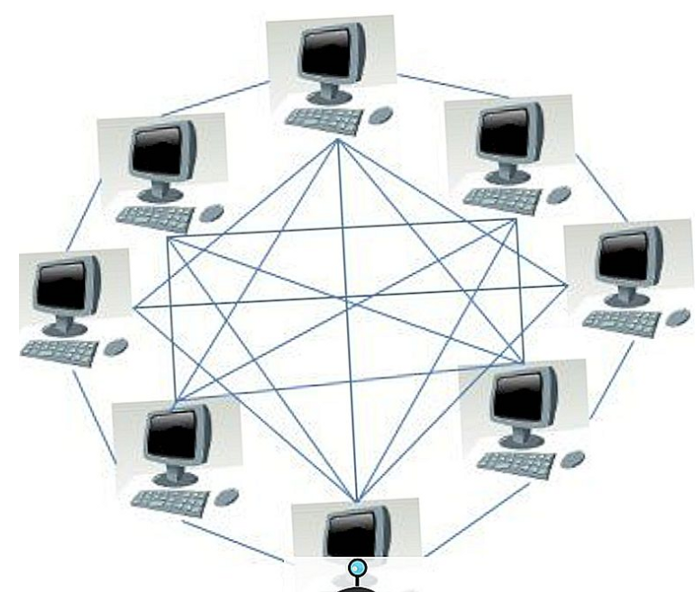
각 노드가 서비스를 요청하는지, 또는 제공하는지에 따라 각 노드가 클라이언트 또는 서버가 될 수 있다. 각 노드는 피어로 간주가 된다.  
특정 서비스를 원하는 노드는 p2p 시스템의 다른 모든 노드에 서비스 요청을 `브로드캐스트` 한다. 요청된 서비스를 제공하는 노드는 요청한 노드에 응답을 하는 방식이다.  
분산된 여러 노드에 의해 서비스가 제공되므로 병목현상은 존재하지 않는다.

## API - Application Programming Interface
어떠한 응용프로그램에서 데이터를 주고받기 위한 방법이다.  
어떤 특정사이트에서 특정 데이터를 공유할 경우, `어떠한 방식으로 정보를 요청`해야하는지, 그리고 `어떠한 데이터를 제공받을 수 있는지`에 대한 `규격(=인터페이스)` 이라 정의가능하다.  
더 쉽고 활용하기 편한 규약인 XML 이나 JSON을 예로 들 수 있다.

## IP
인터넷 환경에서의 주소 체계
IP를 사람이 보기 좋게 바꾼것이 `도메인` 이다.
### IPv4 vs IPv6
최초의 안정적인 인터넷 프로토콜(IP) 버전은 IPv4 이다.  
NAT를 없앰으로써 주소 공간을 32비트에서 128비트로 확장을 하였다.  
처리 오버헤드가 줄어든 개선된 헤더구조라 할 수 있다.  
여기서 `NAT` 란, Network Addess Translation 으로, 사설 IP 주소를 공인 IP 주소로 바꿔주는데 사용하는 통신망의 주소 변환기이다.  
인터넷의 공인 IP 주소를 절약할 수 있기 떄문에 NAT를 사용한다. 또한, NAT 내부의 사용자들이 NAT를 통해 인터넷과 같은 공공망에 접속하기 때문에 NAT 외부의 침입자들로부터 보호될 수 있다는 점이 있다.
하지만 왜 NAT를 IPv6에선 없앴을까?? 그 이유는 패킷 헤더의 소스 주소를 수정하는 데서 비롯되는 익명성을 줄여 보안성을 더 높였기 떄문이다.

## DNS
Domain Name Server 이다. 인터넷은 서버들을 유일하게 구분할 수 있는 IP 주소를 기본 체계로 이용하는데 숫자로 이루어진 조합이라 인간이 기억하기에는 한계가 있다.  
따라서, DNS를 이용해 IP 주소를 인간이 기억하기 편한 `언어체계`로 변환할 수 있기 때문에 사용을 한다.

## 외부 IP, 내부 IP
외부 IP는 공인 아이피라고 할 수 있다. 공인 IP는 1개가 존재한다. 즉, 공유기가 가진 IP라고 할 수 있다.  
내부 IP는 공유기에 연결된 네트워크 기기가 가지는 IP 이다. 외부 IP 만으로는 부족해서 생겨난 개념이다.

## Proxy
서버와 클라이언트 사이에 중계기로서 대리로 통신을 수행하는 것을 가리켜 `프록시`, 그 중계기능을 하는 것을 `프록시 서버`라고 한다. 프록시 서버 중 일부는 프록시 서버에 요청된 내용들을 캐시를 이용하여 저장해준다.

### Forward Proxy
  

클라이언트(사용자)가 인터넷에 직접 접근하는게 아니라, 포워드 프록시 서버가 요청을 받고 인터넷에 연결하여 결과를 클라이언트에게 전달 (forward) 해준다.

### Reverse Proxy
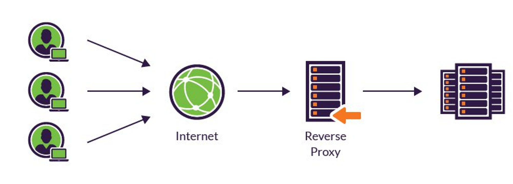  

클라이언트가 인터넷에 데이터를 요청하면 리버스 프록시 이 요청을 받아 내부 서버에 데이터를 받은 후 클라이언트에게 전달하는 방식이다.  
클라이언트가 내부 서버에 대한 정보를 알 필요 없이 리버스 프록시에만 요청을 하면 된다.  
내부 서버(WAS) 에 직접적으로 접근한다면 DB에 접근할 수 있기 때문에 리버스 프록시를 두고 클라이언트와 내부 서버 사이의 통신을 담당하는게 중요하다.  
내부 서버에 대한 설정으로 로드 밸런싱이나 서버 확장에 유리하다.

### Forward Proxy VS Reverse Proxy
1. End Point
포워드 프록시는 클라이언트가 요청하는 End Point가 실제 서버 도메인이고, 프록시는 둘 사이의 통신을 담당하는 반면, 리버스 프록시는 클라이언트가 요청하는 End Point가 프록시 서버의 도메인이고, 실제 서버의 정보는 알 수 없다.

2. 감춰지는 대상
포워드 프록시는 클라이언트가 감춰진다.  
요청받는 서버는 포워드 프록시 서버를 통해서 요청을 받기 때문에 클라이언트의 정보를 알 수 없다.  
반면, 리버스 프록시는 서버가 감춰진다.  
클라이언트는 리버스 프록시 서버에게 요청하기 때문에 실제 서버의 정보를 알 수 없다.

## 네트워크 장비
### 허브
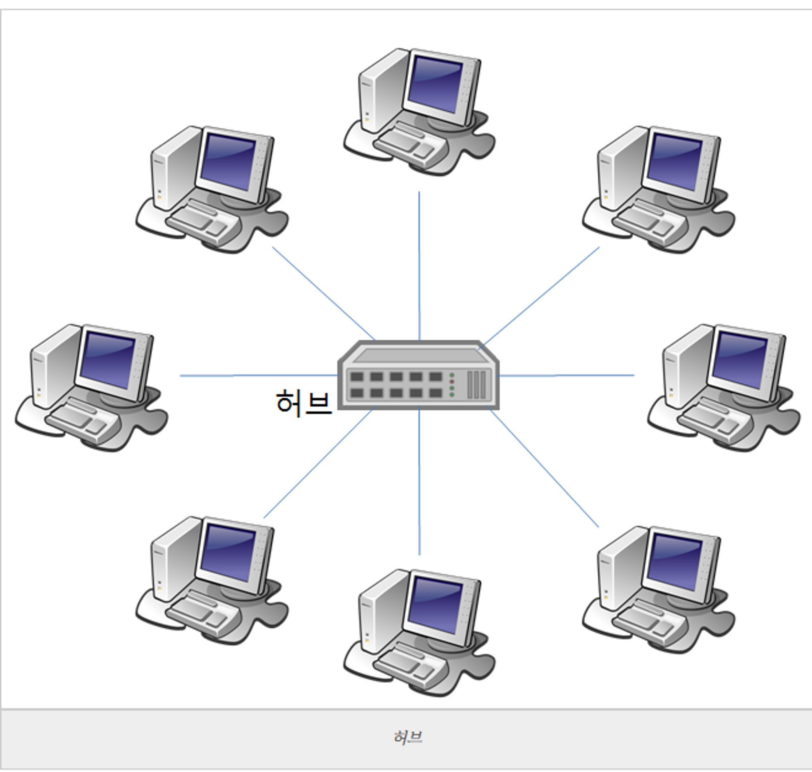  
  
전기적인 신호를 증폭시켜 LAN(Local Area Network)의 전송거리를 연장시키고, 여러대의 장비를 LAN에 접속할 수 있도록 한다. 한 장비에서 전송된 데이터 프레임을 허브로 연결된 모든 장비에게 다 전송하며 이를 플러딩(flooding) 이라한다.  

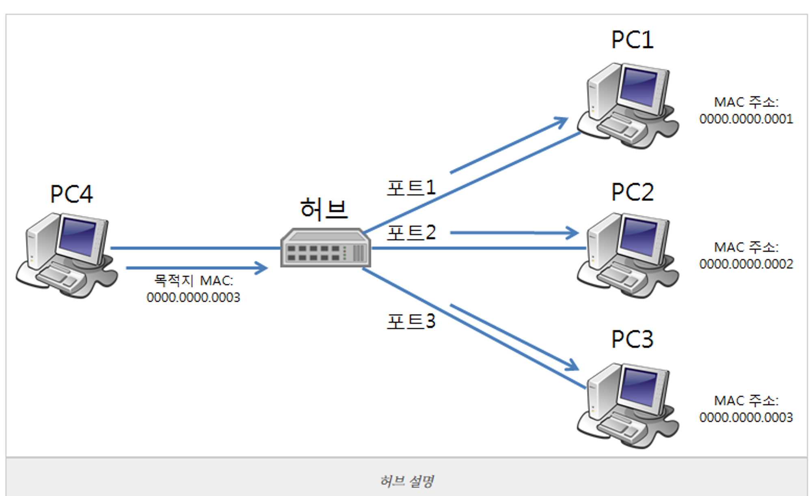  

그림에서 보이듯이, PC4 에서 PC3 으로 프레임을 전송하면 PC3 뿐만 아니라 PC1, PC2 에게도 전송된다.  
결과적으로 충돌이 많이 발생할 수 밖에 없다. 그래서 하나의 허브에 많은 장비를 연결할 수 없다. 같은 이유 때문에 보안성도 떨어진다.  
또한, 하프 듀플렉스(half duplex) 로만 동작하기 때문에 이더넷 프레임의 충돌이 발생할 가능성이 높고, 네트워크 성능도 떨어진다.  
여기서 half duplex란, 한 쪽이 송신하는 동안, 다른 쪽에서 수신하는 방식이다. 데이터를 송신하는 동안엔 수신하지 못한다.
### 스위치
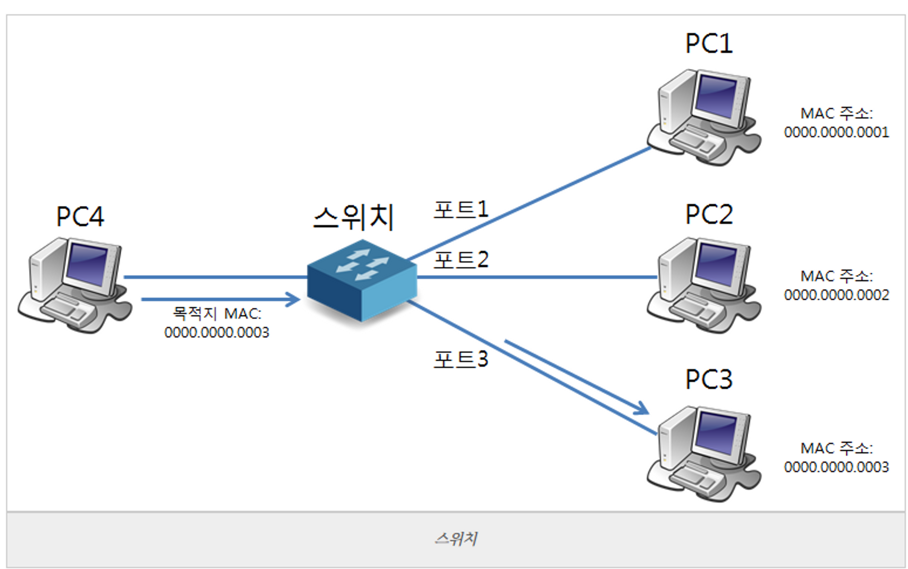  

MAC 주소와 포트번호가 기록된 MAC 주소 테이블을 가지고 있어, 목적지 MAC 주소를 가진 장비가 연결된 포트로만 프레임을 전송한다.  
PC4 에서 목적지 MAC 주소인 PC3로 프레임을 스위치로 전송하면, 해당 PC가 연결되어 있는 포트3 으로만 프레임이 전송된다.  
다른 포트가 전송하는 프레임과 충돌이 일어나지 않는다. 네트워크 성능이 허브보다 향상되고 보안성도 좋아진다. 

### 라우터
  
IP 주소등, 레이어3에 있는 주소를 참조하여 목적지와 연결되는 포트로 패킷을 전송시켜준다.   
서브넷이 다른 IP 주소를 가진 장비간에 통신이 이루어지게 하려면 반드시 레이어3 장비를 거쳐야만 한다.  
스위치는 멀티캐스트, 브로드캐스트 및 목적지를 모르는 유니캐스트 프레임을 수신하면 수신 포트를 제외한 모든 포트로 플러딩시키는 반면, 라우터는 이런 프레임을 모두 차단한다.  
네트워크 주소가 서로 다른 장비들을 연결할 때 사용한다.

### `공유기`
스위치의 기능에 라우터의 기능 일부가 추가된 것이다.  

>게이트웨이 == 라우팅 + 스위칭  

공유기를 인터넷 회선에 연결하고 컴퓨터를 여러 대 연결한 경우 공유기 내부의 DHCP 서버에서 각 PC에 사설 IP 를 할당해준다. 연결된 모든 컴퓨터는 IP 를 할당받기 때문에 모두 인터넷 접속이 가능해진다.  
공유기 내부의 라우터(NAT 기능: 네트워크 주소 변환 기능)에서는 이 사설 IP와 외부 회선의 IP를 분배해서 연결한다.  
공유기는 외부 인터넷 회선(WAN: Wide Area Network)과 내부 네트워크(Local Area Network)를 연결하는 장치여서 WAN과 LAN 포트 구분이 있다.

# 미션
## 스탠다드 미션
> 개인 컴퓨터 환경에서 포트포워딩을 통해 외부에서 접속하여 웹사이트 띄우기

포트포워딩 규칙을 먼저 설정해줬다.  
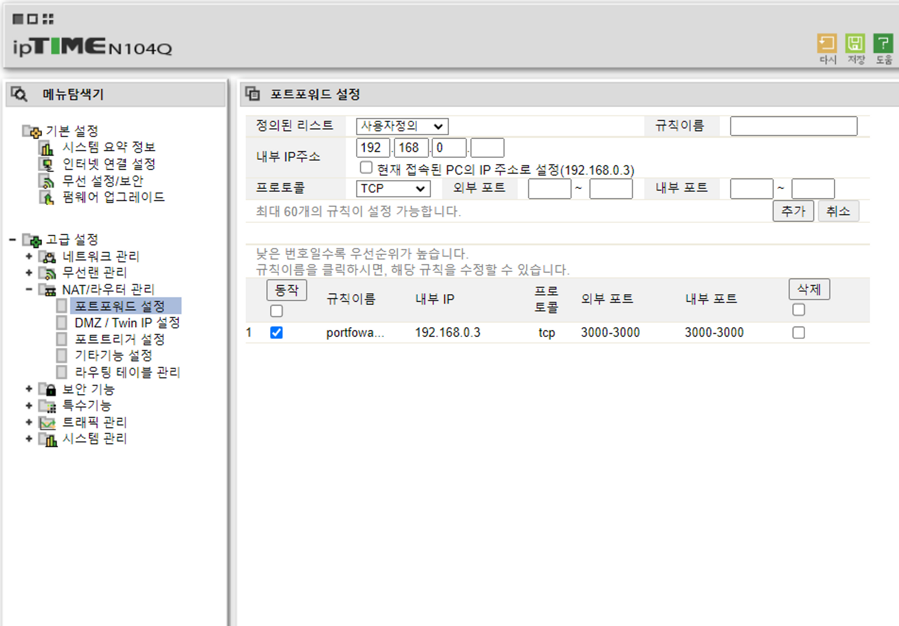

개인 웹사이트 서버를 3000번 포트로 실행을 시켜줬다. 그런다음, 웹 브라우저에 localhost:3000 주소로 접속을 하여 페이지를 띄웠다.  
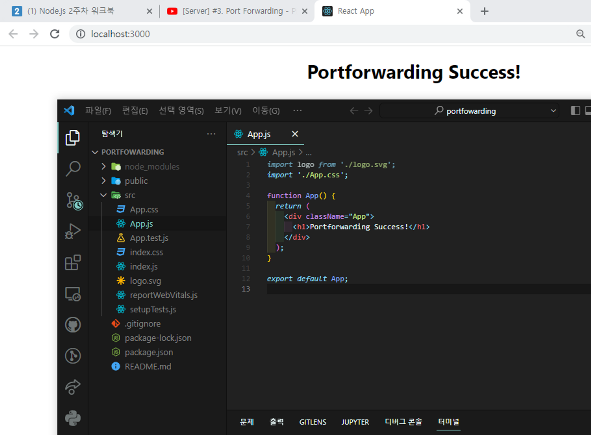  
  
내 컴퓨터의 ip 주소를 확인하니, 221.146.39.143 이었고, 휴대폰으로 이 ip 주소로 접속을 해보았더니 성공하였다.  
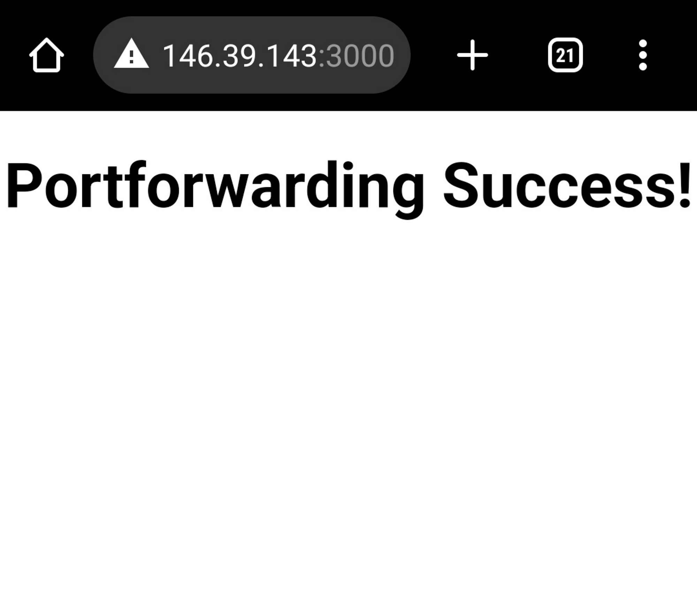

도메인 설정 후, 재접속을 하니 여전히 웹페이지가 잘 뜨는 것을 확인하였다.

## 챌린지 미션
> 알 FTP 등을 통해 FTP 도 외부에서 접속 가능하게 만든다.

`FTP: File Transfer Protocol`  
대량의 파일을 네트워크를 통해 주고 받을 때 사용하면 유리하다.  
FileZilla를 활용하여 FTP 서버 구축 및 클라이언트와의 연결을 설정하였다.

1. FileZilla Server 다운로드
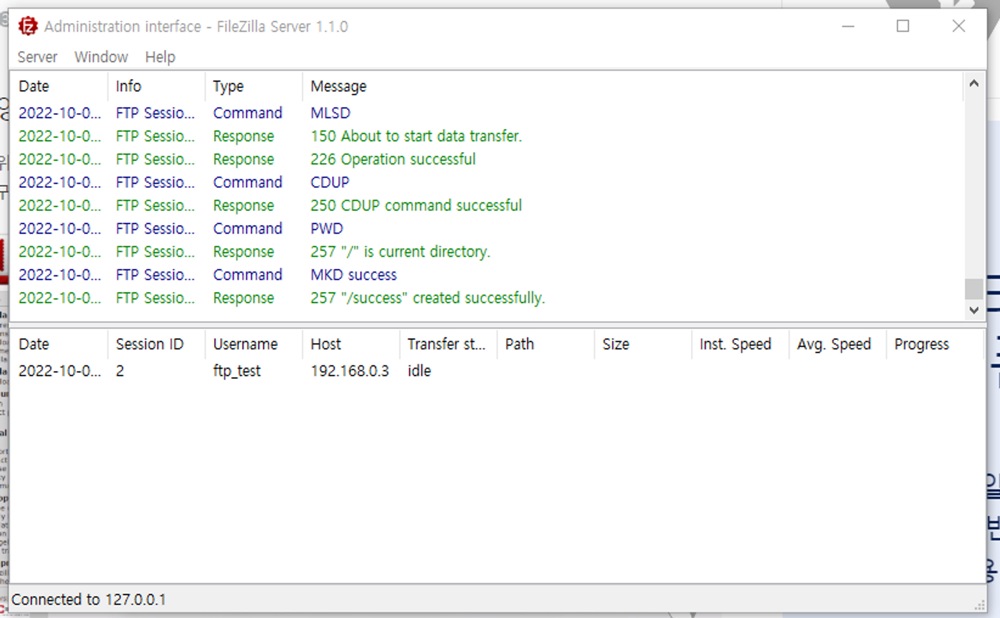  

2. Server Config 설정
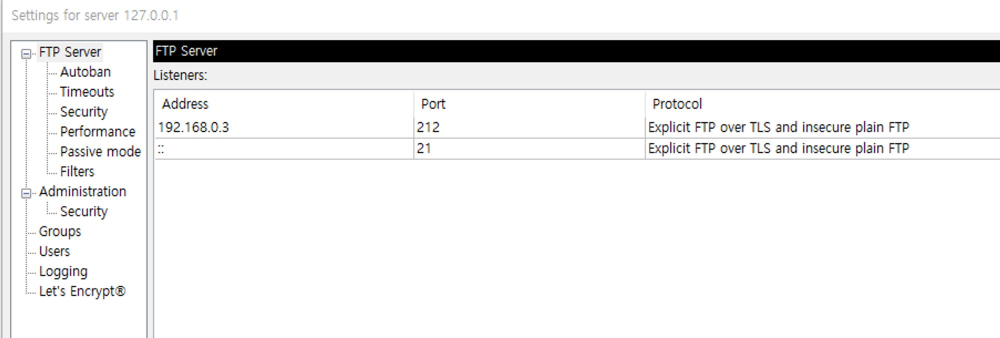  
본인 컴퓨터의 IP 주소를 입력해주어야 한다.  
기본포트는 21인데, 간혹 21번 포트를 인터넷 업체에서 막아두는 경우가 있어서, 212로 설정을 해주었다.
그런데, 만약 정규포트인 21번을 사용하지 않을 경우 접속 및 로그인은 되지만, 디렉토리 목록을 불러오질 못하거나 데이터 전송이 안되는 경우가 발생할 수 있다.  
이 경우, FTP Client에서 Passive mode를 사용해야 할 수 있다. 그러므로, Passive mode를 설정해주었다.

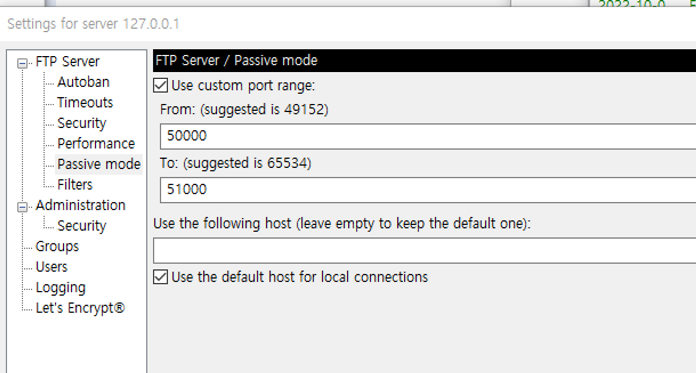  
  
그 다음, 사용자 추가 작업을 진행하였다.
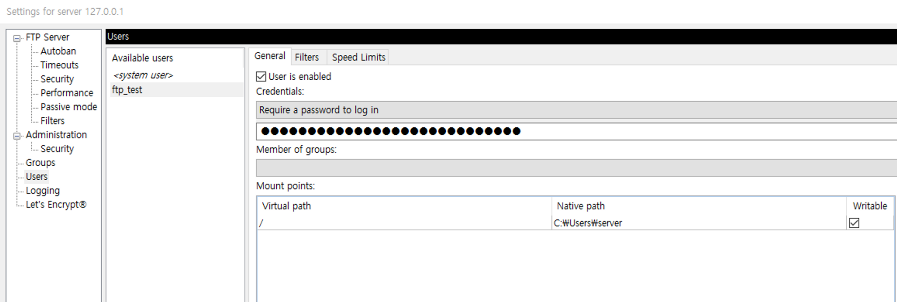  

- Virtual Path : 실제 경로 노출을 제한하기 위한 경로 -> 미지정시 "/"만 입력하면 된다.
- Native Path : 실제 경로
- Writable : 해당 경로의 파일을 수정할 수 있는 권한을 주고 싶다면 체크

3. 포트포워딩 수행

4. 고급 NAT 설정 - FTP 비정규 포트
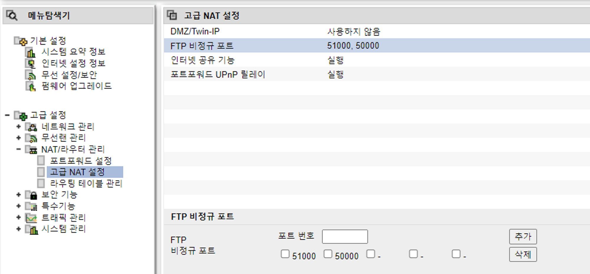  
Passive Mode를 사용할 시에, 비정규 포트 설정을 안하면 오류가 날 수 있다고 한다.

5. Windows 방화벽 설정
FileZilla를 설치 시 자동적으로 방화벽 설정이 되지 않으므로, 수동으로 해줘야 한다.
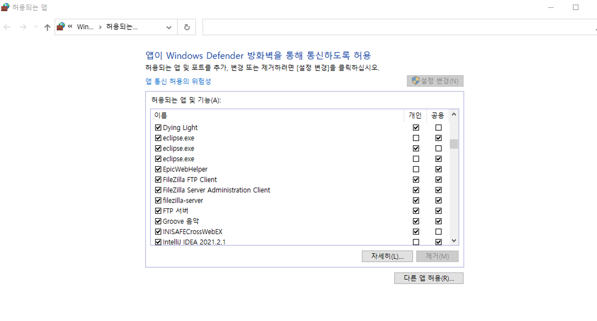  
FileZilla Server 와 Client 모두 방화벽 설정을 해주면 된다.

6. FileZilla Client를 통해 접속
아까 C:\Users\server 경로로 FileZilla Server를 세팅해주었다.  
server 폴더에 success 폴더를 생성하니까 바로 내 컴퓨터에도 반영이 되는 것을 확인하였다.
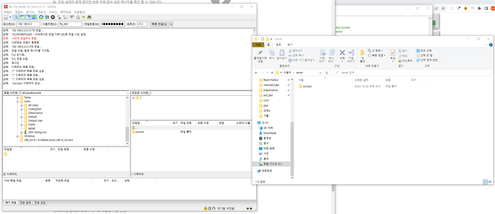

# 트러블 슈팅

1. LG U+ CHGW Web
무선랜 암호로 접속하려 했지만 접속이 안되었다.  
이때, 무선랜 암호가 아닌 `웹 admin 암호`로 접속해야 한다.
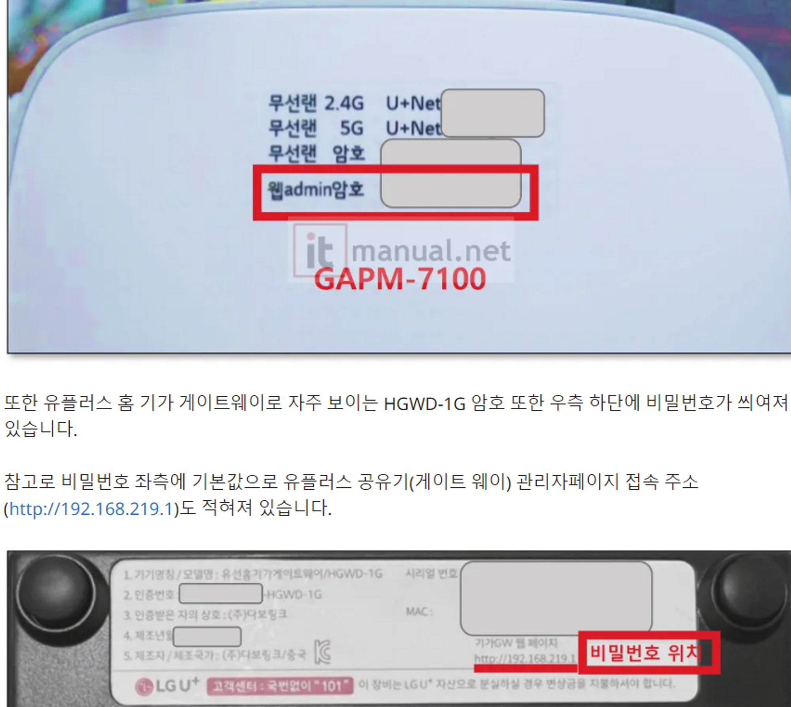

- 참고자료
[https://itmanual.net/lg-유플러스-공유기-초기화-리셋-비밀번호-찾기/](https://itmanual.net/lg-유플러스-공유기-초기화-리셋-비밀번호-찾기/)

2. 도메인을 설정하는 과정에서, 클라이언트 접속 차단이 자꾸 뜸

이 문제는 펌웨어 업그레이드를 통해 기존 9.06 버전에서 10.06.8 버전으로 업그레이드하여 문제를 해결하였다.

- 참고자료
[https://jb-skin-131.tistory.com/4](https://jb-skin-131.tistory.com/4)

3. '다른사용자의 호스트이름' 혹은 '등록되지 않은 호스트이름'으로 나올 경우
말 그대로 등록하려 하는 호스트 이름이 다른 사용자에게 이미 등록된 경우에 뜨는 오류이다.
펌웨어 업그레이드 후, DDNS 설정을 다시 해주니 해결이 되었다.

- 참고자료
[https://m.blog.naver.com/PostView.naver?isHttpsRedirect=true&blogId=sde1206&logNo=220937543007](https://m.blog.naver.com/PostView.naver?isHttpsRedirect=true&blogId=sde1206&logNo=220937543007)

# 참고링크
- 포트포워딩, 내부IP, 외부IP, 포트포워딩 하는법
    
    [https://etloveguitar.tistory.com/9](https://etloveguitar.tistory.com/9)
    
- 클라이언트 서버 vs peer to peer
    
    [https://ko.gadget-info.com/difference-between-client-server](https://ko.gadget-info.com/difference-between-client-server)
    
- API란?
    
    [https://steemit.com/kr/@yahweh87/it-api](https://steemit.com/kr/@yahweh87/it-api)
    
- NAT 기술, 왜 IPv4 주소 고갈의 완전한 해결책이 될 수 없었는가??
    
    [https://m.blog.naver.com/PostView.naver?isHttpsRedirect=true&blogId=nackji80&logNo=220504083147](https://m.blog.naver.com/PostView.naver?isHttpsRedirect=true&blogId=nackji80&logNo=220504083147)
    
- Proxy란? Forward Proxy VS Reverse Proxy
    
    [https://bcp0109.tistory.com/194](https://bcp0109.tistory.com/194)
    
- 네트워크 장비 정리
    
    [https://yys630.tistory.com/27](https://yys630.tistory.com/27)
    
- 웹 사이트 보안 강화를 위한 10가지 팁
    
    [https://www.thewordcracker.com/miscellaneous/웹사이트-보안-강화를-위한-10가지-팁/#ftoc-heading-1](https://www.thewordcracker.com/miscellaneous/%EC%9B%B9%EC%82%AC%EC%9D%B4%ED%8A%B8-%EB%B3%B4%EC%95%88-%EA%B0%95%ED%99%94%EB%A5%BC-%EC%9C%84%ED%95%9C-10%EA%B0%80%EC%A7%80-%ED%8C%81/#ftoc-heading-1)
    
- Multi Server 환경에서 Session이 구성되는 방법
    
    [https://hyuntaeknote.tistory.com/6](https://hyuntaeknote.tistory.com/6)
    
- 알 FTP 서버 운영을 위한 공유기 설정방법
    
    [http://www.mygnit.co.kr/bbs/board.php?bo_table=bo_08&wr_id=31](http://www.mygnit.co.kr/bbs/board.php?bo_table=bo_08&wr_id=31)
    
- 남는 윈도우 pc를 설버 및 ftp 설치하여 외부 접속 가능하게 하는 방법
    
    [https://lse626.tistory.com/148](https://lse626.tistory.com/148)